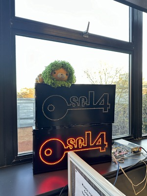

<!--
   Copyright 2022, UNSW
   SPDX-License-Identifier: CC-BY-SA-4.0
-->
# Gpu example

This example does a "happy path" testing of the gpu subsystem. It showcases all
gpu requests and the most common state transitions that can occur.

## Building

The following platforms are supported:
* qemu_virt_aarch64

Note that this example depends on `imagemagick`.

For `apt` users: `sudo apt-get install imagemagick`.

For Homebrew users: `brew install imagemagick`.

### Simulating on QEMU
This example only supports simulating with QEMU only linux machines as it requires the 'udmabuf' framework.
This is a requirement in order to enable virtio-gpu blob resources. Additionally, sudo permissions is required
to access the `udmabuf` framework.

This example also requires you to have a compatible GUI installed for QEMU.
Make sure QEMU's default display is not set to `-display none`.

### Make

```sh
make MICROKIT_SDK=<path/to/sdk> MICROKIT_BOARD=<board>
```

After building, the system image to load will be `build/loader.img`.

If you wish to simulate on the QEMU virt AArch64 platform, you can append `qemu` to your make command.

You can optionally provide `FB_IMG=<path/to/your/image>` to scanout your own image to the display.

### Zig

You can also build this example with the Zig build system:
```sh
zig build -Dsdk=/path/to/sdk -Dboard=<board>
```

The options for `<board>` are the same as the Makefile.

You can simulate QEMU with:
```sh
zig build -Dsdk=/path/to/sdk -Dboard=qemu_virt_aarch64 qemu
```

The final bootable image will be in `zig-out/bin/loader.img`.

## Running

This example takes in an image 'fb_img.jpeg', and scans out different sections of it to the display.
The default image has dimensions 300 (width) x 400 (height) and is converted into BGRA format during the build phase.
The image is patched into the binary directly during the build phase.



Upon runtime the client sends a series of request that will cycle between 6 states:
Drawing full image -> Drawing top right quadrant -> Destroying all objects -> Drawing full image with blob resources
-> Drawing bottom right quadrant with blob resources -> Destroying all objects.
These states transition every second. A different resource is created for each draw step,
but they are attached with the same memory backing. After demonstrating the regular resources and blob resources,
the client requests to destroy the resources and disable the scanout.

### Running on QEMU

Resizing the QEMU GUI will send a `display_info` event to the virtualiser which will then forward this event to the client.
Note that in this example the client only stores the new scanout information but does not make use of it.
